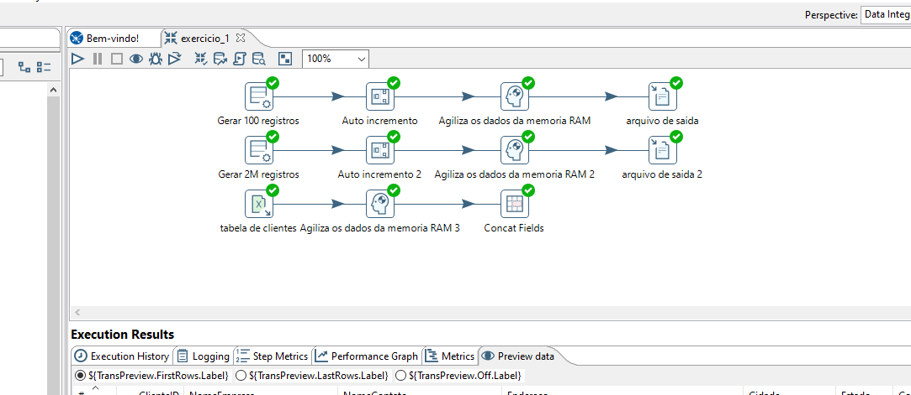

# Organização e Manipulação de Dados

### Ciência de Dados - UNIPÊ - 2023.2

Exercícios práticos utilizados no estudo da disciplina **Organização e Manipulação de Dados** ministrada pelo professor [Ricardo Roberto](https://www.linkedin.com/in/ricardo-roberto-de-lima-1504aa7b/) no **Centro Univesitário de João Pessoa (UNIPÊ)**. Na disciplina foram abordados conceitos de Modelagem de Banco de Dados, SQL e Business Intelligence, além do conteúdo teórico, também foi feito exercícios práticos com o uso de plataformas como pgAdmin, MySQL Workbench, Pentaho e o banco de dados Sakila.

